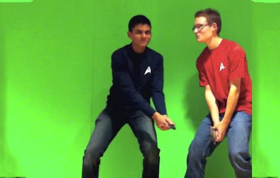

During high school, I specialized in post-production and visual effects computation for student film projects. While my collaborator Albert Hynek focused on cinematography and directing, I handled the digital workflow, specifically **chroma key compositing** (green screen).

## Technical Implementation

The primary tool for these projects was **Adobe After Effects CS5/CS6**. My responsibilities included:

- **Keying**: Removing green/blue backgrounds cleanliness using the Keylight effect.
- **Rotoscoping**: Manually isolating subjects when keying failed due to lighting inconsistencies.
- **Compositing**: Integrating subjects into generated backgrounds, often simulating sci-fi environments (Star Trek themes were a frequent motif).
- **Color Correction**: Matching the lighting and color temperature of the foreground subject to the digital background for realism.

This experience built a strong foundation in layer-based compositing logic and timeline management, skills that later translated well into UI/UX animation and non-linear editing.
