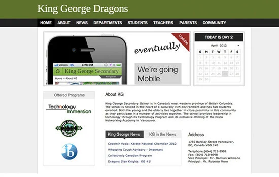

I served as one of the lead webmasters for King George Secondary, managing the school's digital presence from ideation in 2010 to a full launch in August 2011. The platform served as the central hub for the school community, replacing fragmented paper bulletins.

## Key Contributions

- **Portal Management**: Maintained a centralized CMS for school events, assignment calendars, and administrative announcements.
- **Live Broadcast Infrastructure**: Engineered a live-streaming solution for the senior Varsity basketball team (2011-2012 season). This involved setting up capture hardware, encoding streams, and distributing them to the public web, significantly boosting community engagement.
- **IT Leadership**: Demonstrated the value of student-led IT initiatives to the administration, creating a model for digital engagement.

*Note: The system was eventually deprecated following a Vancouver School Board (VSB) IT centralization initiative to unify school web architectures.*
