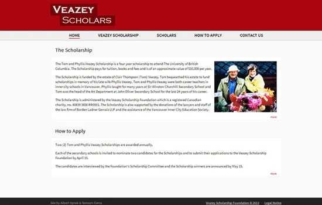

I collaborated with Albert Hynek to design and develop the digital presence for the **Veazey Scholarship Foundation**, an initiative supported by the Canadian law firm **Borden Ladner Gervais LLP (BLG)**.

The project involved creating a professional, accessible informational site for prospective applicants.

*Note: I was also a proud recipient of the Tom and Phyllis Veazey Scholarship, making this a project of personal significance.*

Visit this site: [http://veazeyscholars.com/](http://veazeyscholars.com/)
