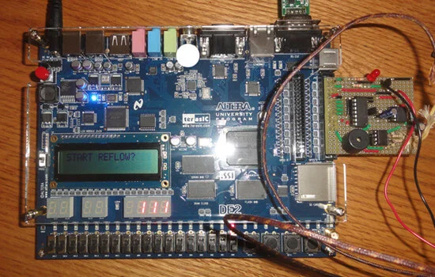

I collaborated with a team of six to engineer a precise **reflow soldering oven controller** using the **DE2-8052 microcontroller (FPGA)**. The system aimed to adhere to industry-standard reflow thermal profiles.

## Technical Architecture

The project integrated low-level hardware control with high-level software interfaces:

- **Firmware (Assembly)**: Wrote optimized assembly code to handle sensor data acquisition and heating element control loops.
- **Middleware (Java)**: Developed a desktop application that communicated over serial (UART) to receive real-time temperature telemetry and visualize it on a live strip chart.
- **Database (SQLite)**: Integrated a local database to store historical reflow profiles and run parameters.
- **Interface (Android)**: Built a mobile app allowing users to remotely configure reflow parameters (preheat, soak, reflow, cooling) via the Java bridge.

## Outcomes

The solution successfully automated the soldering process, allowing users to monitor temperature curves in real-time on their mobile devices, significantly improving the user experience compared to traditional on-device 7-segment displays.
