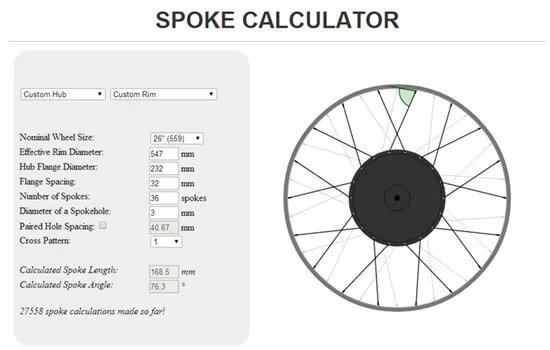

The **Spoke Calculator** is a precision tool I developed to help mechanics and hobbyists build bicycle wheels. Because wheel building tolerances are extremely tight (±1mm), accurate calculation is critical.

## Features

- **Visual Lacing**: Unlike spreadsheet calculators, this tool renders a real-time vector graphic of the wheel using the **JSGL** library.
- **Dynamic Calculation**: Users inputs rim diameter, hub flange dimensions, and spoke count to get instant length requirements.
- **Pattern Verification**: It allows users to visualize different cross-patterns (1-cross, 3-cross) to ensure physical compatibility with the hub.

## Tech Stack

- **Frontend**: HTML5, CSS3, JavaScript
- **Vector Graphics**: JSGL Library
- **Backend logic**: PHP (legacy support)

Try it out here: [http://www.ebikes.ca/tools/spoke-calc.html](http://www.ebikes.ca/tools/spoke-calc.html)
