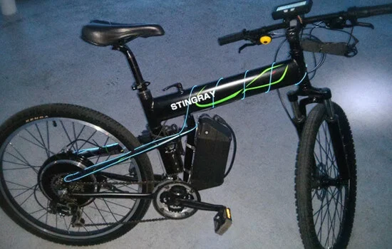

Leveraging my experience at **Grin Technologies**, I engineered a custom electric bicycle optimized for urban commuting and efficiency testing. The build integrated commercial off-the-shelf components with custom telemetry solutions.

## Component Specifications

- **Frame**: Montague Paratrooper (Folding Mountain Bike)
- **Propulsion**: **Nine Continent 2807** Direct Drive Hub Motor (optimized for regenerative braking).
- **Power Storage**: **AllCell Technologies** 36V 11Ah Li-ion battery (utilizing Phase Change Material for thermal management).
- **Control System**: **ASI BAC-350** Field-Oriented Controller (FOC) for silent, efficient operation.
- **Lighting**:
  - **Front**: Cycle Lumenator (1000 lumen output, tapping into main pack voltage).
  - **Rear**: Electrolight (Integrated brake light).
- **Telemetry & Human Machine Interface**:
  - **Display**: **Cycle Analyst V3** (Primary dashboard for tracking Ah consumed, Watts, Speed).
  - **Data Logging**: Custom-solder **HC-05 Bluetooth Module** bridge to transmit serial data to the [EV Trip Analyzer](/portfolio/ev-trip-analyzer/) web app.

*Note: This vehicle served as the primary testbed for the EV Trip Analyzer software.*
