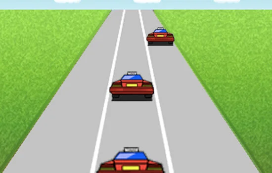



**UberNios** is a custom hardware/software co-design project demonstrating full-stack embedded development—from the logic gate level up to the application layer. We built a functional arcade game console on an Altera DE2 FPGA board.

## Technical Architecture

The system uses a **system-on-chip (SoC)** approach, instantiating a Nios II soft-core processor alongside custom hardware peripherals in the FPGA fabric.

### 1. Hardware Design (VHDL/Verilog)

- **VGA Controller**: Custom logic to drive the VGA DAC, handling timing signals (HSYNC/VSYNC) for 640x480 output.
- **Audio Codec Interface**: Direct hardware interface to the Wolfson WM8731 codec for lag-free sound effects.
- **Input Controllers**: Drivers for PS/2 keyboard/mouse and on-board push buttons.

### 2. Software Layer (C / Assembly)

- **Graphics Engine**: Implemented a "2.5D" perspective engine. It used efficient sprite scaling and shifting to simulate depth, optimizing for the Nios II's limited clock speed.
- **Render Loop**: Optimized drawing routines to only redraw "dirty pixels" (changed regions) rather than full frame buffering, ensuring high frame rates (60 FPS).
- **Audio Engine**: Utilized hardware timers and interrupts to feed audio samples to the FIFO buffer, preventing CPU stalling.

### 3. Multiplayer Networking

- **Ethernet Driver**: Wrote a raw packet driver for the DM9000A controller.
- **Protocol**: Simple custom protocol to synchronize game states between two FPGA boards connected via Ethernet, allowing for head-to-head racing.

## Outcomes

The project successfully demonstrated the power of hardware acceleration for specific tasks (graphics/audio) while keeping game logic flexible in software.

**Tech Stack:**

- **Hardware**: Altera DE2 Development Board (Cyclone II FPGA)
- **HDL**: VHDL, SystemVerilog
- **Soft Core**: Nios II
- **Language**: C, MIPS Assembly
- **Tools**: Quartus II, SOPC Builder
