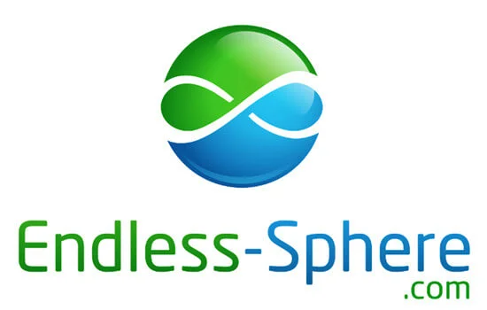

**Endless-Sphere** is the premier online community for DIY electric vehicle enthusiasts, boasting over 25,000 active members and millions of posts. The forum serves as a critical knowledge base for the EV industry.

## The Challenge

The site was hosted on a legacy Virtual Private Server (VPS) that suffered from:

- **Frequent Downtime**: Hardware limitations led to database locking during peak traffic.
- **High Costs**: Inflexible pricing models meant paying for peak capacity 24/7.
- **Security Logic**: Lack of automated backups and no SSL/TLS encryption.

## Technical Solution

I led the migration and modernization effort, serving as the lead Systems Administrator.

### 1. Cloud Migration (AWS)

- **Lift & Shift + Optimize**: Migrated the LAMP stack (Linux, Apache, MySQL, PHP) to Amazon Web Services (EC2).
- **Database Optimization**: Tuned the MySQL configuration to handle high-read/low-write workloads typical of forum software (phpBB).

### 2. DevOps & Automation

- **Backups**: Implemented automated incremental snapshots (EBS) and S3 off-site backups to ensure data durability.
- **Security**: Deployed **Let's Encrypt** certificates for complying with modern HTTPS standards, improving SEO and user trust.
- **Cost Reduction**: Utilized Reserved Instances and rightsizing to reduce monthly hosting costs while improving uptime availability to 99.9%.

## Outcome

The migration stabilized the platform, allowing the community to grow without technical interruptions.
*(Note: You can find me on the forum under the username **gammaray**)*

[Visit Endless-Sphere](https://endless-sphere.com)
