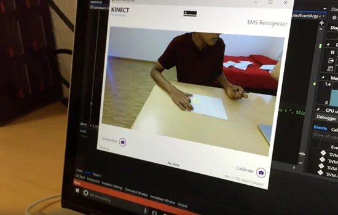



**Kinect SVM** is a computer vision application that allows users to trigger operating system tasks (like launching apps or controlling volume) by drawing specific shapes on a piece of paper in front of a Kinect camera.

## Technical Implementation

### 1. Recognition Pipeline

- **Depth Segmentation**: Utilized the Kinect's depth sensor to isolate the user's hand and the paper from the background scene.
- **Feature Extraction**: Processed the image frames to extract the contours of the hand-drawn shapes.
- **Classification**: Fed these features into a trained **Support Vector Machine (SVM)** to identify the shape (e.g., Triangle, Circle, Star).

### 2. Performance Optimization

- **Multithreading**: Implemented a heavy multi-threaded architecture in C++. One thread handled the high-bandwidth 1080p video ingestion, while separate worker threads processed the SVM prediction logic.
- **Frame Rate**: Successfully maintained a stable **30 Frames Per Second (FPS)** detection rate, ensuring the interaction felt "real-time" to the user.

### 3. Training Utility

- **Custom Tooling**: Built a companion desktop application that allowed us to rapidly record new gestures and train the SVM model, making the system extensible.

**Tech Stack:**

- **Language**: C++
- **Hardware**: Microsoft Kinect v2
- **Libraries**: OpenCV (Computer Vision), LIBSVM
- **OS**: Windows
