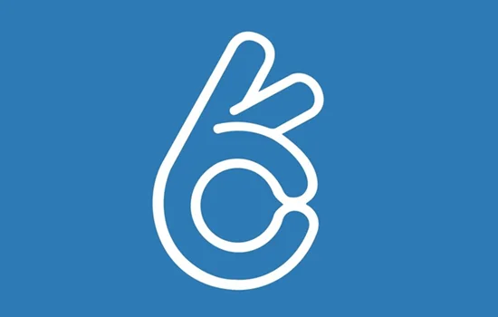

**Kudolife** is a comprehensive health and wellness tracking application. As a full-stack developer at **Prizm Media**, I was responsible for maintaining and enhancing both the mobile apps and the backend infrastructure.

## Key Improvements

### 1. Backend Optimization

- **Performance Tuning**: Analyzed and optimized slow database queries and API endpoints.
- **Result**: Achieved an average **50% reduction in API response time** across the platform, significantly improving the app's responsiveness and "snappiness" for users.

### 2. Feature Development

- **Cross-Platform**: Published multiple updates to both the **iOS** (App Store) and **Android** (Google Play) applications.
- **New APIs**: Designed and implemented new RESTful API endpoints availability to support novel tracking features requested by the product team.
- **Bug Fixes**: Systematically eliminated backlog bugs revealed during QA testing.

**Tech Stack:**

- **Mobile**: Android (Java), iOS (Objective-C/Swift)
- **Backend**: PHP, MySQL, REST API
- **Tools**: JIRA, Git

[Visit Kudolife](http://www.kudolife.com/)
