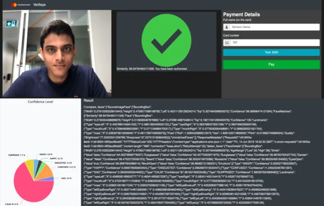

**Verifeye** was a Proof of Concept (PoC) developed during Mastercard's Innovation Week. The project aimed to rethink payment authentication by moving beyond static passwords to dynamic biological markers.

## The Concept

We designed a passive authentication layer that works in the background during a transaction.

### 1. Identity Verification

- **Facial Age/Gender Estimation**: Used computer vision to compare the user's estimated demographics against the cardholder's file.
- **Liveness Detection**: Ensured the user is a real person and not a photograph.

### 2. User Sentiment

- **Friction Analysis**: Analyzed facial expressions to determine "customer delight" or frustration during the checkout flow. This data could help merchants optimize their UX.



