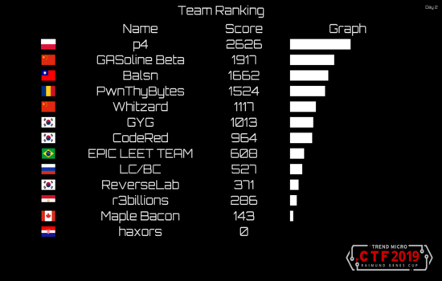



As a key member of the CTF team **Maple Bacon**, I helped secure a spot in the prestigious Trend Micro CTF Finals held in Tokyo, Japan.

## The Achievement

- **Selection**: We qualified by placing in the top 10 online out of over 800 competing teams globally.
- **Performance**: In the finals, we placed **12th overall**, marking a significant milestone for Canadian representation in international cybersecurity competitions.
- **Challenges**: The competition involved high-pressure scenarios in binary exploitation, IoT security, and industrial control systems (ICS).


