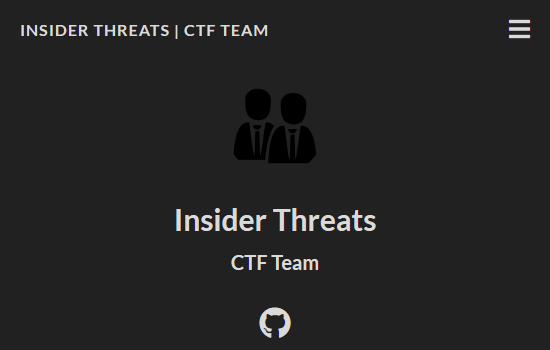

To foster a culture of security awareness and technical curiosity, I founded **"Insider Threats"**, a Capture The Flag (CTF) team at the Mastercard Vancouver office.

## Initiative Goals

The goal was to upscale the engineering team's understanding of offensive security concepts to better defend our own systems.

## Key Activities

- **Workshops & Tutorials**: I designed and led hands-on sessions covering fundamental security topics:
  - **Binary Reversal**: Analyzing compiled executables to understand logic flow and vulnerabilities.
  - **Digital Forensics**: Investigating artifacts to reconstruct security incidents.
  - **Web Exploitation**: Understanding common vulnerabilities like SQLi and XSS.
- **Team Coordination**: Organized participation in competitive CTF events, fostering team bonding and collaborative problem-solving under pressure.
