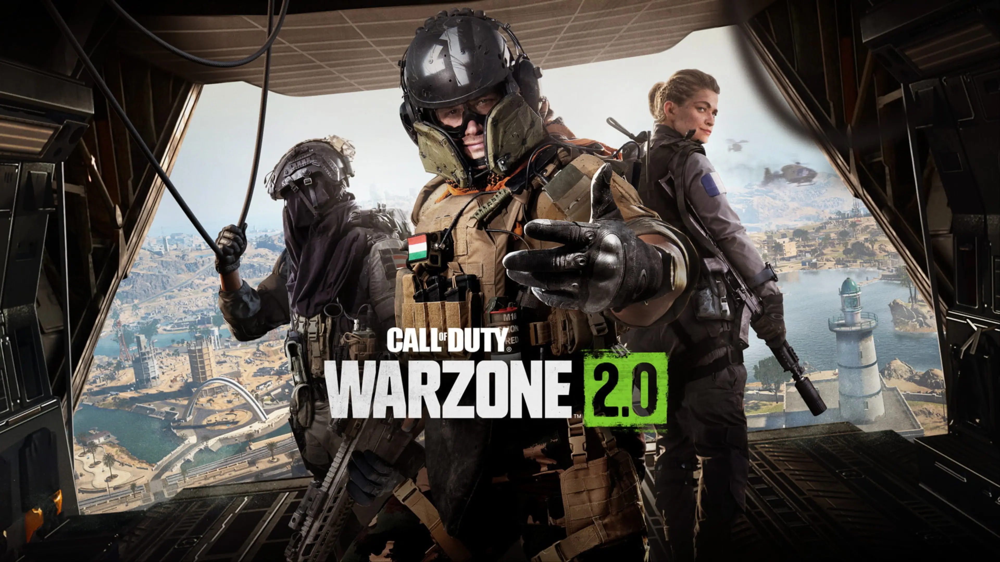

At **Demonware (Activision)**, I worked on the core services powering the battle royale experience for **Call of Duty: Warzone 2.0**.

## Contributions

- **Scalability**: Optimized backend services to handle peak load during launch windows.
- **Reliability**: Monitored and remediated incidents in real-time to ensure high uptime for players.
- **Efficiency**: Improved resource utilization of game server fleets.

**Tech Stack:**

- **Languages**: Python, C++, Golang, Bash
- **Infrastructure**: Kubernetes, On-Prem
