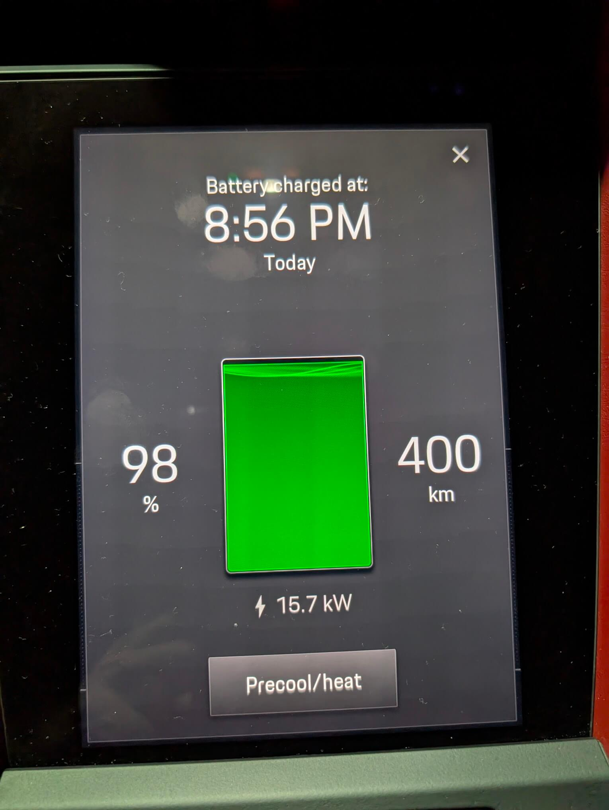

## Summary 🧭

During my time as Strata Council President at Marina Pointe, I worked on a number of projects, but the EV upgrade is one I'm especially proud of.

EV ownership has been steadily increasing, and we could see that more residents were either driving electric vehicles or planning to. Our existing electrical setup was not designed for that level of demand.

Key drivers were:

- **Provincial targets:** BC Zero Emission Vehicles Act goals of 26 percent of new vehicle sales by 2026 and 90 percent by 2030.
- **Resident demand:** clear interest from owners and residents.
- **Rebate deadline:** incentives scheduled to end on **February 28, 2024**.

We replaced two older unmetered chargers with **18** smart, networked, metered units. The new system allows us to manage electrical load, scale as demand increases, and ensure users pay for what they consume, while maintaining overall electrical stability in the building.

---

## Technical Visualization: Project Timeline & Dependencies 📆

The following diagram illustrates the critical phases and the timeline.


flowchart TD
  A["Owner Interest Survey Mar 2022"] --> B["Electrical Load Assessment 2022"]
  B --> C["BC Hydro Rebate Pre-Approval 2023"]
  C --> D["Vendor/Proposal Acceptance Jan 2024"]
  D --> E["Materials + Permitting Jan-Feb 2024"]
  E --> F["Legacy Decommission Feb 13, 2024"]
  F --> G["Install Panel + Transformer Feb 2024"]
  G --> H["Final Cutover + Commission Feb 28, 2024"]
  H --> I["Rebate Submission Deadline Feb 28, 2024"]
  H --> J["User Registration Post-Cutover"]


---

## Technical Deep Dive: Electrical Infrastructure ⚡

The main task was to integrate a **280 Amp** total reserved load without forcing a costly strata main-service upgrade, which is a common issue for buildings over 25 years old. Fortunately, this was not a problem for this project.

### Conceptual Electrical Flow Diagram 🧩

The new system operates through a dedicated sub-panel and is supplied by **two dedicated transformers**. This subsystem is isolated from the rest of the building's common area services, and its total load is actively managed by the Plugzio system.

**Note that the EV Panel and Load Management System have been simplified for this post.**


flowchart TD
  A["Building Main Service"] --> B1("Transformer 1")
  A --> B2("Transformer 2")
  B1 --> C["New Dedicated EV Panel"]
  B2 --> C
  C --> D{"Plugzio Load Management System (LMS)"}
  D --> E1["EV Charger 1"]
  D --> E2["EV Charger 2"]
  D --> E3["..."]
  D --> EN["EV Charger N"]

  subgraph EC["Electrical Components"]
    B1
    B2
    C
    D
  end


### Key Technical Specifics ✅

- **Total Reserved Capacity:** **280 Amps**. This capacity is the maximum total load allocated for the entire EV charging subsystem and is managed across the new electrical infrastructure, including the two transformers.
- **Capacity Proof & Verification:** The capacity was verified by **McKinley Electric** using a **Power Analyzer** to log historical load data, a critical step required for the **City of Vancouver (COV)** electrical permit to prove available head-room on the existing building service.
- **New Equipment:** The installation involved a **new dedicated electrical panel** and **two new dedicated transformers** to service the EV system. **Note:** The exact KVA or Amp ratings are not being disclosed in this post.
- **Load Management System (LMS):** The Plugzio LMS is central to the design. It acts as a circuit breaker, dynamically allocating the **280A capacity** among all active chargers. This prevents the main breaker from tripping and allows the Strata to install more chargers than the panel could support if they were all charging at max capacity simultaneously.

## Carbon Credit Revenue Stream 💰

The installation of new, metered EV charging stations created a passive revenue stream for the Strata through the accumulation of carbon credits.

- **Revenue generation:** The metered stations enable the Strata to generate tradable carbon credits based on EV energy consumption.
- **Projected income:** The Strata's carbon credit income for the installation's initial period was **$2,500 in 2023**.
- **Future projections:** Based on usage, the Strata is projected to generate **$12,000 for 2024** from this carbon credit revenue.
- **Intended use of funds:** This revenue is being collected to supplement the Strata's general income. A draft report noted that the **$12,000/year** from EV-generated carbon credits would contribute to overall revenue streams.

## The Legacy System: Eaton Chargers 🧯

In total, the project covered **11 chargers**: **two older Eaton units** in the Landmark (LM) section, **seven new chargers** in the Waterworks (WW) visitor parking area, and the replacement of two old chargers in the WW section.

### Operational and Technical Flaws of the Eaton System 🔧

The original chargers, operational for **over 10 years**, presented significant operational challenges that the new system was designed to resolve:

- **Non-Networked Status:** The Eaton chargers were **non-networked**, lacking smart communication, remote control, and consumption data.
- **Manual Activation:** Their non-networked nature required concierge staff to **manually turn the breakers in P1 on and off every few hours** to activate and deactivate the chargers, which created a steady and tedious staff task.
- **Billing and Theft Issues:** They were associated with **electricity theft** and operated on a simple **flat-rate charging fee** ($75/month was an estimate of average consumption), which did not incentivize turnover and was more likely to be overused by high-use vehicles (like Uber/Lyft).
- **Decommissioning:** The former Eaton chargers were officially decommissioned on **February 13, 2024**.

## Phase 1: Planning, Feasibility, and Initial Design (2022 - Early 2023) 🧠

This initial phase focused on assessing resident interest, securing funding, and determining the electrical feasibility of the new system.

### 1. Owner Interest Survey 🗳️

The project began with a formal **EV Charging Survey** sent to all owners in **March 2022** to gauge the demand for EV charging within the building.

### 2. Electrical Load Assessment and Permitting (The 280A Challenge) 🧮

Given the building is over 25 years old, an early step was confirming the existing infrastructure could support the new load.

- **Capacity Proof:** The contractor, McKinley Electric, was required to use a **Power Analyzer** to monitor the main distribution panel's load profile over a period of time.
- **Design & Engineering:** Initial budget concerns led to the removal of the **design assessment** cost from the contractor's scope, indicating budget constraints were a factor from the start.

### 3. Rebate Pre-Approval and Vendor Selection 🧾

The project's financial viability was tied to a BC Hydro EV charger rebate, which required specific eligible hardware and a defined approval process.

- **Initial Challenge:** The rebate application was initially rejected because the quote identified the chargers as "Plugzio," a brand not yet listed as eligible at the time (July 2023).
- **Resolution:** The quote was modified to reference eligible **Wallbox Pulsar Plus** devices or other Plugzio-branded, Wallbox-compatible hardware that was later confirmed as eligible (August 2023). The available rebate amount was noted to be up to **$5,000 per charger** with a maximum of **$25,000**.

## Phase 2: Financial, Vendor Lock-in, and Logistics (Late 2023 - Early 2024) 💼

This phase finalized the vendor and scheduling ahead of the rebate deadline.

### 1. Proposal Acceptance and Deposit 🧾

Following council approval, the financial agreement was executed.

- **Acceptance:** The Strata Council accepted the quote, authorizing work to begin.
- **Payment:** A 50% deposit was paid to **Parkizio Technologies LTD** (Plugzio's parent company) in **January 2024** to initiate the order and installation process.

### 2. Permit Acquisition and Scheduling 🗓️

To meet the rebate deadline of February 28, 2024, the process required immediate action and coordination.

- **Schedule:** The electrical contractor, Recharge Electric, emphasized starting early to **secure permits** and **organize materials** due to long lead times for specialized electrical components.
- **Installer Coordination:** The Strata Manager and the building's electrician, McKinley Electric, coordinated with Recharge Electric for the final power cutover, ensuring minimal disruption to the building's common areas.

## Phase 3: Decommissioning, Installation, and Commissioning (February 2024) 🛠️

The final stages involved removing the old equipment and integrating the new system into the building's electrical infrastructure.

### 1. Decommissioning of Legacy System 🧹

The old **Eaton chargers** were officially decommissioned on **February 13, 2024**. Current users were directed to use temporary chargers (EV chargers 8 and 9) in the WW P1 visitor area to minimize service interruption.

### 2. Technical Commissioning Sequence 🔌

The commissioning involved a sequence of electrical work to bring the new system online.


sequenceDiagram
  participant S as Strata Council/Manager
  participant RE as Recharge Electric (Electrical Contractor)
  participant ME as McKinley Electric (Building Electrician)
  participant COV as City of Vancouver (Permits)
  participant BH as BC Hydro

  S->>RE: Issue PO & 50% Deposit (Jan 2024)
  RE->>COV: Submit Electrical Permit Application
  RE->>RE: Procure New Panel & Transformers
  ME->>RE: Decommission Legacy Eaton System (Feb 13)
  RE->>RE: Install New Dedicated Electrical Panel
  RE->>RE: Install New Transformers
  S->>ME: Schedule Common Area Power Shutdown
  ME->>RE: Verify Main Breaker Lock-Out for Safety
  RE->>ME: Final Electrical Tie-in (New Panel to Service)
  ME->>S: Power Restored
  RE->>COV: Schedule Final Electrical Inspection
  COV->>RE: Pass Final Inspection
  RE->>S: System Handover & Commissioning
  S->>BH: Submit Rebate Final Application (Feb 28 Deadline)


### 3. Electrical Tie-in and Commissioning 🔒

The new system's power infrastructure was finalized with a scheduled power shutdown.

- **Final Cutover:** A **power shut down of the common areas of Landmark** was scheduled for **February 28th at 10 am** to connect the new subsystem to the building service. This was the final technical step of the electrical installation and needed to meet the rebate deadline.

---

## Phase 4: User Onboarding and Program Management (Ongoing) 🚗

With the chargers operational, the focus shifted to user onboarding and policy rules under Canadian regulations.

### 1. User Account and Agreement 🧾

To access the new system, users must complete two steps:

- **Agreement:** Sign the **Plugzio EV Charging User Agreement**.
- **Account:** Register for a **Plugzio account** for billing and access control.

### 2. Charging Policy and Compliance (Measurement Canada) ⚖️

The pricing model was discussed with residents, but the main driver is regulatory compliance.

**Measurement Canada compliance (why time-based):**
Charging by **kilowatt-hour (kWh)** is regulated in Canada. For non-utility operators, kWh billing requires Measurement Canada-approved metering and ongoing compliance. To avoid the administrative work of applying for temporary dispensation per device and monitoring accuracy, the Strata adopted time-based billing.

**Pricing model (time-based tiers):**

- **Tier 1 (First 4 hours):** **$2.00 per hour** (considered the "affordable rate" for an average user).
- **Tier 2 (4-6 hours):** **$3.00 per hour**.
- **Tier 3 (6+ hours):** **$4.00 per hour**.
- **Payment fees:** Plugzio uses PayPal, which charges the user **$0.30 + 2.9%** for adding money to their wallet.

**Why the tiers exist:**

1. **Stall turnover:** Discourages long idle sessions.
2. **Efficient charging:** Encourages stopping around **80%**, where charge speed is still high.

**Liability:** The User Agreement explicitly states that the **User is solely responsible** for the operation and safety of their vehicle, and the Operator (Strata) assumes **no liability** for any damage or injury from the station's use.

**External references:**

- [Measurement Canada](https://ised-isde.canada.ca/site/measurement-canada/en)
- [Electricity and Gas Inspection Act (Canada)](https://laws-lois.justice.gc.ca/eng/acts/E-4/)
