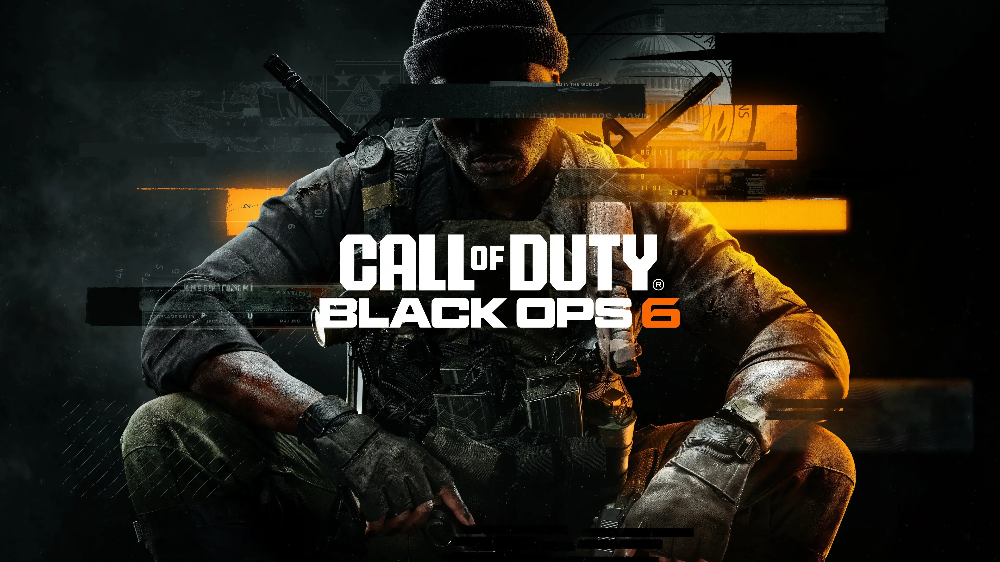

## Scope

Supported the core online services behind **Call of Duty: Black Ops 6** at **Demonware (Activision)**. The work focused on production reliability, launch-scale readiness, observability, and operational response for high-traffic multiplayer systems.

## What I Owned

- **Service reliability for live player systems**: Operated production services with emphasis on uptime, fault tolerance, and safe release behavior during live events.
- **Capacity and launch readiness**: Helped prepare infrastructure and service behavior for peak traffic windows and large launch demand.
- **Automation and operational tooling**: Built and improved deployment and infrastructure workflows to reduce manual operations and recurring failure modes.
- **Observability and incident response**: Monitored production signals, triaged incidents under load, and translated incident learnings into preventative platform improvements.
- **Cross-team execution**: Partnered with service owners and game teams to keep online experiences stable, performant, and shippable.
- **Operational ownership**: Participated in on-call and reinforced a service-ownership culture for live operations.

## Reliability Outcomes

- Improved operational readiness for launch and live-service demand through stronger reliability and capacity planning practices.
- Reduced repeat operational toil by increasing automation coverage in deployment and infrastructure workflows.
- Strengthened incident response posture with clearer production signals and tighter feedback loops from incident review to remediation.
- Increased resilience of customer-facing game services by prioritizing durable fixes over temporary recovery.

**Tech Stack:**

- **Languages**: Python, C++, Golang, Bash
- **Infrastructure**: Kubernetes, On-Prem
