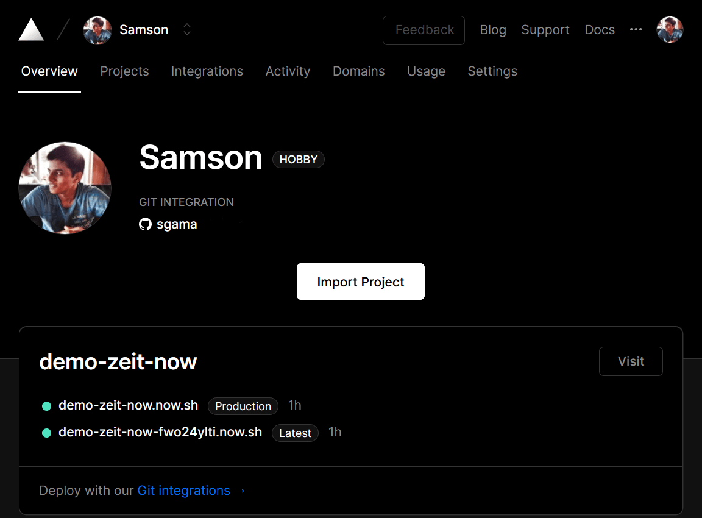

Let me introduce you to this amazing service called [zeit.co AKA ZEIT NOW](https://zeit.co).

I currently use it with another free online service called [MicroBadger](https://microbadger.com/), a service I use to trigger custom Dockerbuilds after a base image such as `alpine` has been updated.
This allows all my personal projects to be on the latest base image potentially improving performance and security.

Microservice sends a POST request to a function hosted on ZEIT NOW, and that function runs a bunch of tasks. Invoking new builds of personal projects that depend on that image, grabbing changelists and sending all that information to Slack.

I won't show you how to do that, but I'll show you how to get started with a full CICD pipeline.

---------------------

ZEIT NOW is self-described as a *All-in-one: Static and JAMstack deployment, Serverless Functions, and Global CDN.* 

In this post, I will be focusing on the *serverless functions* aspect as it is the most unique offering I know of.
Serverless functions are not new. AWS Lambda has been doing it for a few years now, but the utility of Zeit NOW for me is derived from the fact that I did not have to enter any credit card information to get started.

Let's go over the main [limits of the (Hobby) free-tier](https://zeit.co/docs/v2/platform/limits#general-limits):

|2020-01-01|Hobby|Pro|Enterprise|
|---|---|---|---|
|Deployments (per day)|100|2000|Custom|
|Serverless Functions per Deployment|12|24|Custom|
|Serverless Functions per Month|160|640|Custom|
|Serverless Function Duration (Seconds)|10|60|900|
|Deployments created from CLI per week|2000|2000|Custom|
|Team members per Team|-|10|Custom|

But let's also remember the [fair-use policy](https://zeit.co/docs/v2/platform/fair-use-policy):

|Examples of Fair Use|Never Fair Use|
|---|---|
|Jamstack sites and apps|Proxies and VPNs|
|Frontends|Media hosting for hot-linking|
|SPAs|Scrapers|
|Functions that query DBs or APIs|Crypto Mining|
|Blogs, e-commerce, marketing|CPU-intensive APIs (e.g.: Machine Learning)|

---------------------

1. Let's get started, install the [zeit/now-cli](https://github.com/zeit/now-cli).

2. Clone/Fork my repository containing the example codebase [sgama/demo-zeit-now](https://github.com/sgama/demo-zeit-now).

3. Import this project through the [ZEIT web portal](https://zeit.co/import).

4. Login to the now cli:
```
$ now login
```

5. Run and deploy with the CLI:
```
/demo-zeit-now$ now
Now CLI 18.0.0
? Set up and deploy “/mnt/c/Vcs/demo-zeit-now”? [Y/n] y
? Which scope do you want to deploy to? MyUser
? Link to existing project? [y/N] n
? What’s your project’s name? demo-zeit-now
? In which directory is your code located? ./
�🔗  Linked to myuser/demo-zeit-now (created .no
�🔍  Inspect: https://zeit.co/myuser/demo-zeit-now/abc12cdef [1s]
✅  Production: https://demo-zeit-now.now.sh [19s]
�📝  Deployed to production. Run `now --prod` to overwrite later (https://zeit.ink/1A).
�💡  To change the domain or build command, go to https://zeit.co/myuser/demo-zeit-now/settings
```

6. Now you should see your deployment at [https://zeit.co/dashboard](https://zeit.co/dashboard)



7. Add the following to your repository's secrets for CICD here: `https://github.com/$YOUR_USER/$YOUR_REPO/settings/secrets`

|ORG_ID|`jq -r '.orgId' .now/project.json`|
|---|---|
|PROJECT_ID|`jq -r '.projectId' .now/project.json`|
|ZEIT_TOKEN|Get one from [https://zeit.co/account/tokens](https://zeit.co/account/tokens)|

8. Uncomment the contents of `.github/workflows/main.yml`

9. Push your code and view the CICD pipeline run: `https://github.com/$YOUR_USER/$YOUR_REPO/actions`

----------------------

Now you can visit the following URLS:

  - `https:/$YOUR_REPO.now.sh/src/nodejs`
  - `https:/$YOUR_REPO.now.sh/src/python`

I'll let you figure the rest out now but in this repo, you will now have a fully integration continuous integration and continuous delivery system deploying functions for free.