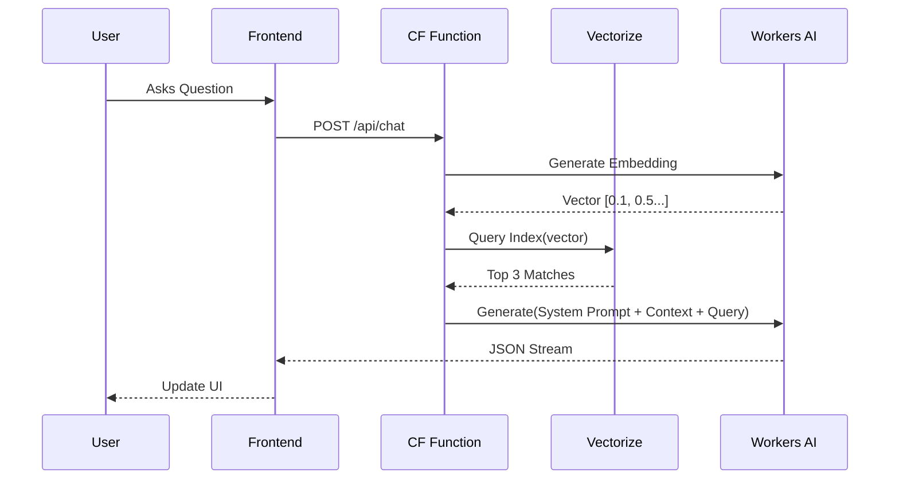
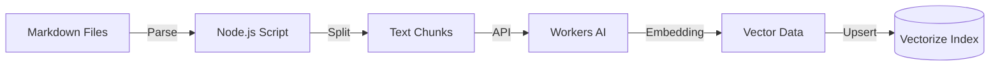

Static sites are great—fast, secure, and cheap. but they often lack interactivity. I wanted to let visitors "chat" with my portfolio, asking questions like *"What experience does Samson have with Python?"* or *"Tell me about the EV Trip Analyzer project."*

Instead of adding a third-party widget, I built a custom, native-feeling solution using the Cloudflare ecosystem. Here is exactly how it works.

## The Architecture

The system uses **Retrieval-Augmented Generation (RAG)**. We don't just ask the AI a question; we first find relevant content from my portfolio, feed it to the AI as context, and *then* ask it to answer.

- **Frontend**: Hugo (Blowfish Theme) + Vanilla JS
- **Edge Compute**: Cloudflare Pages Functions
- **Inference**: Workers AI (Meta Llama 3)
- **Vector Database**: Cloudflare Vectorize
- **Embeddings**: BAAI bge-base-en-v1.5

---

## 1. The Backend: Cloudflare Pages Functions

Cloudflare Pages allows you to drop serverless functions into a `/functions` directory. I created `functions/api/chat.js` to handle the chat requests.

### Configuration (`wrangler.toml`)

First, we bind the necessary resources to our application.

```toml
# wrangler.toml
[ai]
binding = "AI" # Access to Workers AI models

[[vectorize]]
binding = "VECTORIZE_INDEX" 
index_name = "portfolio-index" # Our vector database
```

### The API Logic

The function performs three main steps:

1. **Embed**: Convert the user's query into a vector.
2. **Search**: Query the `VECTORIZE_INDEX` for similar content chunks.
3. **Generate**: Send the context + query to Llama 3 and stream the response.



```javascript
// functions/api/chat.js (Simplified)
export async function onRequest(context) {
    const { query } = await context.request.json();

    // 1. Retrieval: Convert question to vector & search index
    const { data } = await context.env.AI.run('@cf/baai/bge-base-en-v1.5', { text: [query] });
    const vector = data[0];
    const results = await context.env.VECTORIZE_INDEX.query(vector, { topK: 3, returnMetadata: true });
    
    // Combine matched text chunks
    const contextText = results.matches.map(m => m.metadata.text).join("\n---\n");

    // 2. Generation with System Prompt
    const systemPrompt = `You are a helpful assistant for Samson's portfolio. 
    Use the following Context to answer the user.
    Context: ${contextText}`;

    const stream = await context.env.AI.run('@cf/meta/llama-3-8b-instruct', {
        messages: [
            { role: "system", content: systemPrompt },
            { role: "user", content: query }
        ],
        stream: true // Enable streaming response
    });

    return new Response(stream, {
        headers: { "Content-Type": "text/event-stream" }
    });
}
```

---

## 2. The Knowledge Base: Ingesting Content

The AI needs to know about my posts. I wrote a script (`scripts/generate_embeddings.js`) that runs during the build process.



1. It scans all `.md` files in `content/`.
2. It parses the frontmatter and content.
3. It splits the text into chunks of ~500 tokens.
4. It generates embeddings via the Cloudflare API and pushes them to Vectorize.

### Safety Guardrails

Because Large Language Models can hallucinate or be tricked into saying inappropriate things, I implemented strict system prompts. The AI is explicitly instructed to:

1. **Maintain a professional tone.**
2. **Stick to the context.** If the answer isn't in my portfolio, it admits it rather than making things up.
3. **Never disparage.** Explicit instructions forbid generating negative content about the portfolio, projects, or individuals.

```javascript
// functions/api/chat.js
const systemPrompt = "You are a helpful assistant for Samson's portfolio. " +
    "Answer concisely based on the context. If uncertain, admit it. " +
    "Always maintain a positive and professional tone. " +
    "Never generate negative, critical, or disparaging content about the portfolio, projects, or any individuals.";
```

```javascript
// scripts/generate_embeddings.js

// 1. Find all Markdown files
const files = glob.sync("content/**/*.md");

for (const file of files) {
    const { content, data } = matter(fs.readFileSync(file, 'utf8'));
    
    // 2. Split into chunks (~500 tokens)
    const chunks = splitText(content, 500);

    for (let i = 0; i < chunks.length; i++) {
        const chunk = chunks[i];
        
        // 3. Generate Embedding using Workers AI
        const embedding = await getEmbedding(chunk);

        // 4. Prepare vector record
        vectors.push({
            id: `${path.basename(file, '.md')}-${i}`,
            values: embedding,
            metadata: {
                text: chunk,
                url: "/" + path.relative("content", file).replace(".md", "")
            }
        });
    }
}

// 5. Batch upsert to Vectorize
await upsertVectors(vectors);
```

---

## 3. The Frontend: Making it "Native"

I didn't want a generic chatbot iframe. It had to look like it belonged to the [Blowfish theme](https://blowfish.page/).

### Theming with CSS Variables

I mapped the chat widget's colors to the theme's CSS variables. This ensures the chat window automatically respects Light/Dark mode and the user's chosen color scheme (Catppuccin, in my case).

```css
/* assets/css/ai-chat.css */
:root {
    /* Map to Blowfish variables */
    --ai-chat-bg: rgba(var(--color-neutral-50), 1);
    --ai-chat-primary: rgba(var(--color-primary-500), 1);
}

.dark {
    --ai-chat-bg: rgba(var(--color-neutral-800), 1);
    --ai-chat-bot-bg: rgba(var(--color-neutral-700), 0.5);
}

#ai-chat-window {
    backdrop-filter: blur(10px); /* Glassmorphism */
    border: 1px solid var(--ai-chat-border);
    /* ... */
}
```

### Mobile Responsiveness

On mobile, popups are annoying. I used a CSS media query to turn the floating window into a **full-screen experience** when on small screens, locking the background scroll to prevent glitches.

```css
@media (max-width: 640px) {
    #ai-chat-window {
        position: fixed;
        inset: 0; /* Full screen */
        width: 100%;
        height: 100dvh;
        border-radius: 0;
    }
}
```

### The "Shining" Button

To make the feature inviting, I added a neon glow animation to the trigger button using CSS keyframes.

```css
@keyframes chatGradientShift {
    0% { background-position: 0% 50%; }
    50% { background-position: 100% 50%; }
    100% { background-position: 0% 50%; }
}

#ai-chat-toggle {
    background: linear-gradient(135deg, #d600d6, #00d6d6, #d6006b);
    background-size: 200% 200%;
    animation: chatGradientShift 3s ease-in-out infinite;
    /* ... */
}
```

---

## 4. Integration via extend-footer.html

Blowfish provides a partial called `extend-footer.html` to inject custom code. I used this to add the button and **lazy-load** the chat logic. The heavy javascript for the chat only loads when the user actually clicks the button.

```html
<!-- layouts/partials/extend-footer.html -->
<div id="ai-chat-widget">
    <button id="ai-chat-toggle" aria-label="Ask AI">
        <svg>...</svg>
        <span>Ask AI</span>
    </button>
</div>

<script>
    // Lazy Load
    document.getElementById('ai-chat-toggle').addEventListener('click', async () => {
        const { initChat } = await import('{{ resources.Get "js/ai-chat.js" | minify | fingerprint }}');
        initChat(true); // Initialize and open immediately
    }, { once: true });
</script>
```

## Future Improvements

While functional, there is always room to grow. Here is what I plan to add next:

1. **Chat History**: Persisting the conversation in `localStorage` so users don't lose context when navigating between pages.
2. **Suggest Questions**: Showing 3-4 clickable "suggestion chips" (e.g., "Tell me about your Python experience") to help users get started.
3. **Source Citations**: Adding small "citations" [1] to the bot's response that link directly to the blog post or portfolio item where the information was found.

## TODO: Advanced UI Features

To demonstrate true full control over the UI, here are the advanced features I plan to implement next:

1. **Markdown Parsing**: Currently, the bot outputs raw text. I want to render `**bold**`, lists, and code blocks properly on the fly as tokens stream in.
2. **Syntax Highlighting**: Using a lightweight library to highlight code snippets inside the chat bubble, matching the site's theme.
3. **Agentic Actions**: Allowing the AI to "drive" the website. If a user asks to see a project, the AI handles the navigation programmatically.
4. **Voice Input**: Integrating the Web Speech API to allow users to speak their questions instead of typing.
5. **Draggable UI**: Making the chat window floating and draggable on desktop, saving its position for the next visit.

## Conclusion

By leveraging Cloudflare's edge platform, I was able to build a fast, private, and deeply integrated AI assistant without managing a single server. The result is a portfolio that doesn't just display information—it interacts with you.
