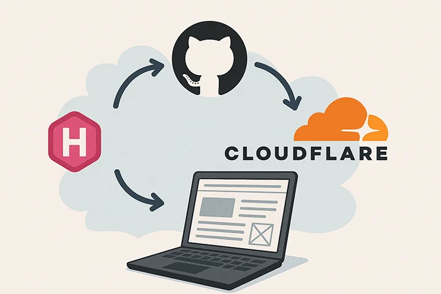

About 10 years ago, hosting a website meant paying \$5/month for a VPS, configuring Nginx, and manually FTPing files. Today, we have the "Modern Web"—a beautiful, chaotic mix of static site generators, edge computing, vector databases, and zero-trust tunnels.

This website is a static site (Hugo), but it's wrapped in layers of automation and serverless features that make it feel alive. Here is an architectural overview of how `samsongama.com` is built, deployed, and monitored, updated for the current implementation.

## 🏗️ The High-Level Architecture

At its core, the site lives on the **Cloudflare Edge**. Content is distributed globally, while dynamic features (like the AI Chat) run on serverless workers. Analytics are self-hosted on my home lab but exposed securely to the internet.


graph TD
User((Visitor))

subgraph Cloudflare["☁️ Cloudflare Edge"]
    DNS[DNS & DDoS Protection]
    CDN[CDN Cache]
    WAF[Web App Firewall]
    Pages[Cloudflare Pages]
    Functions[Pages Functions /api/chat]
    Workers[Cloudflare Workers AI]
    Vectorize[Vectorize]
    KV[KV Chat Logs]
    Tunnel[Cloudflare Tunnel]
end

subgraph Github["🐙 GitHub"]
    Repo[Source Code]
    Actions[GitHub Actions CI/CD]
end

subgraph HomeLab["🏠 Home Lab"]
    Cloudflared[cloudflared daemon]
    Analytics[Analytics Container]
end

User -->|HTTPS| DNS
DNS --> WAF
WAF --> CDN

CDN -->|Static Content| Pages
CDN -->|Dynamic API| Functions
Functions --> Workers
Functions --> Vectorize
Functions --> KV
CDN -->|ping.samsongama.com| Tunnel

Tunnel <-->|Secure Connection| Cloudflared
Cloudflared <--> Analytics

Repo -->|Push| Actions
Actions -->|Deploy| Pages


---

## 1. Development & Quality Assurance

Quality starts before the code even leaves my machine. I use **pre-commit** hooks to ensure standards are met.

### Pre-commit Configuration

Every time I run `git commit`, a series of checks fire off locally:

1. **File Safety**: Checks for private keys, merge conflicts, large files, and invalid configuration syntax. Private-key detection is not a comprehensive API-token scanner.
2. **Linting**: Checks JavaScript, YAML, Markdown, TOML formatting, and spelling.
3. **Content Checks**: Checks front matter presence and flags oversized images. Production rendering is checked separately in CI.

```yaml
# .pre-commit-config.yaml
repos:
  - repo: https://github.com/pre-commit/pre-commit-hooks
    rev: v6.0.0
    hooks:
      - id: trailing-whitespace
      - id: end-of-file-fixer
      - id: check-yaml
      - id: check-added-large-files
      - id: detect-private-key
```

---

## 2. CI/CD: GitHub Actions

Production deployment is handled by a **GitHub Actions** workflow on pushes to `develop`. Pull requests targeting `develop` run validation without deploying or making paid embedding calls. Make targets also support deliberate local builds and deployments.

### The Pipeline Steps

1. **Checkout**: Pulls the latest code.
2. **Setup Node & Hugo**: Installs dependencies.
3. **Validate & Build**: Runs `make ci-check`: workflow and JavaScript linting, offline tests with coverage, corpus checks, Functions compilation, PostCSS/PurgeCSS, the production Hugo build, and generated-layout tests.
4. **Refresh Corpus**: Runs `make ai-refresh` to skip an unchanged corpus or embed a changed one into a versioned Vectorize namespace. It waits for indexing before preparing the matching deployment configuration; failure blocks deployment.
5. **Deploy**: Runs `make deploy-built` to upload the validated `public/` output and Functions to Cloudflare Pages.
6. **Cleanup**: Removes previews, prunes old production deployments while retaining rollback history, and deletes versioned corpora no retained deployment references.

For example, a CSS-only change can reuse the existing corpus. A published content edit changes the corpus hash and requires new embeddings before the deployment proceeds.


sequenceDiagram
participant Dev as Developer
participant GH as GitHub Actions
participant Build as Build Container
participant CF as Cloudflare Pages
participant Vec as Vectorize DB
participant AI as Workers AI

Dev->>GH: git push develop
GH->>Build: Spin up Runner
Build->>Build: Install Hugo & Node
Build->>Build: make ci-check

rect rgb(20, 20, 20)
    Note over Build, Vec: Refresh changed corpus; skip unchanged corpus
    Build->>Build: Parse content and compute corpus hash
    opt Corpus changed
        Build->>AI: Generate embeddings
        AI-->>Build: Return vectors
        Build->>Vec: Upsert versioned records
        Build->>Vec: Wait for indexing completion
    end
end

Build->>CF: Deploy assets, Functions and matching namespace
CF-->>Dev: Deployment Success 🚀
Build->>CF: Prune previews and old deployments
Build->>Vec: Delete unreferenced corpora


---

## 3. The Edge: Cloudflare Ecosystem

Once deployed, the site lives on Cloudflare's network. Static hosting, edge caching and managed TLS reduce the infrastructure I operate; dynamic AI and storage still have usage limits and potential charges.

### DNS & CDN

Cloudflare proxies all traffic. This means:

- **SSL is automatic:** I don't manage certificates; Cloudflare handles edge encryption.
- **Caching:** Static assets (images, CSS, JS) are cached in data centers close to the user, reducing latency.
- **Build-Time Optimization:** Hugo minifies output, while PostCSS/PurgeCSS builds the production stylesheet. This does not depend on Cloudflare auto-minification.

### Workers & Vectorize (The "Smart" Layer)

This is where the [AI Assistant](/posts/2026-01-25-ai-chat/) lives. A **Cloudflare Pages Function** handles `/api/chat`, **Workers AI** provides embedding and answer models, and **Vectorize** holds the searchable corpus. I do not operate a dedicated Python inference server or train model weights.

- **Conversation:** The browser sends bounded recent history. A follow-up such as "What did he do before that?" is rewritten into a standalone search question before embedding.
- **Retrieval:** Vectorize returns three semantic matches. Matching child excerpts expand into bounded source sections, with generic canonical-source links keeping curated summaries tied to authoritative public content.
- **Generation:** The answer model receives retrieved text, history and the original question, then streams its response. Insufficient context produces an abstention; service failures produce explicit errors.
- **Transparency:** The widget shows actual progress stages, public retrieved excerpts and expandable timing/token/cost diagnostics. Source retrieval does not independently verify an answer.
- **State:** Conversation history stays in browser storage across deployments until manually cleared. When configured, KV separately records questions, responses and answer-model usage.

For example, an internship excerpt can lead retrieval to the full newest-first employment section, rather than presenting that historical fragment as recent experience. This reduces missing context; it does not guarantee that a model interprets every date correctly.

Edge execution reduces the need to manage application servers, but model inference and retrieval still dominate some responses. I measure latency rather than assuming every answer is instant.

---

## 4. Observability: Self-Hosted Analytics via Tunnels

I self-host **Umami**, served at `ping.samsongama.com`, rather than relying on a third-party analytics dashboard. Cloudflare still proxies the traffic, so self-hosting is not a claim that no external infrastructure handles the data. How do I expose the service without forwarding an inbound port on my home router?

**Cloudflare Tunnels (cloudflared)**.

### How it works

Instead of forwarding port `443` on my home router, I run a lightweight daemon called `cloudflared`.

1. `cloudflared` creates an outbound-only connection to Cloudflare's edge.
2. A public hostname, `ping.samsongama.com`, routes analytics traffic through the tunnel.
3. Cloudflare Access can protect private dashboard routes, while the tracking script and collection endpoints must remain accessible to visitors.


flowchart LR
Visitor["Visitor Browser"]
CF["Cloudflare Edge"]
Router["Home Router (No Open Ports)"]
Server["Home Server"]
Container["Analytics Docker"]

Visitor -->|"HTTPS"| CF
CF <-->|"Encrypted Tunnel"| Server

subgraph HomeNetwork["Home Network"]
    Router
    Server -->|"Running cloudflared"| Container
end

style Router stroke:#f00,stroke-width:2px,stroke-dasharray:5


### Benefits

- **No Port Forwarding:** The analytics service does not require an inbound router port or a public DNS record pointing directly to my home IP.

- **Edge Protection:** Public requests pass through Cloudflare; this does not make the origin or application immune to abuse.
- **Access Control:** I can put the dashboard usage behind **Cloudflare Access** (OAuth / Email OTP), so only I can view the data, while the tracking script remains public.

## Conclusion

This stack represents the sweet spot of modern web development: **Static reliability** mixed with **serverless power**, all glue-coded together with **CI/CD** and secured by **Zero Trust** networking.

Static delivery is inexpensive, but this is not an infinitely scalable or universally free stack. Workers AI, Vectorize and KV have quotas and usage-based costs, while self-hosting adds hardware, power and maintenance. The chat's displayed cost estimates cover answer and rewrite tokens, not the entire infrastructure bill.

## What's Next?

- **Retrieval quality:** Expand regression questions and human review, especially for ambiguous follow-ups and unsupported claims.
- **Runtime controls:** Add request deadlines and rate limits, and measure behavior under concurrent traffic.
- **Ingestion efficiency:** Reuse unchanged document embeddings across corpus versions instead of regenerating the whole changed corpus.
